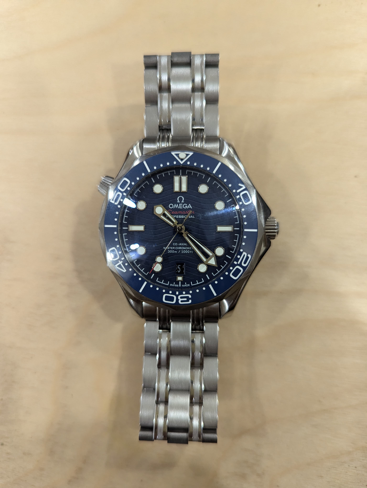
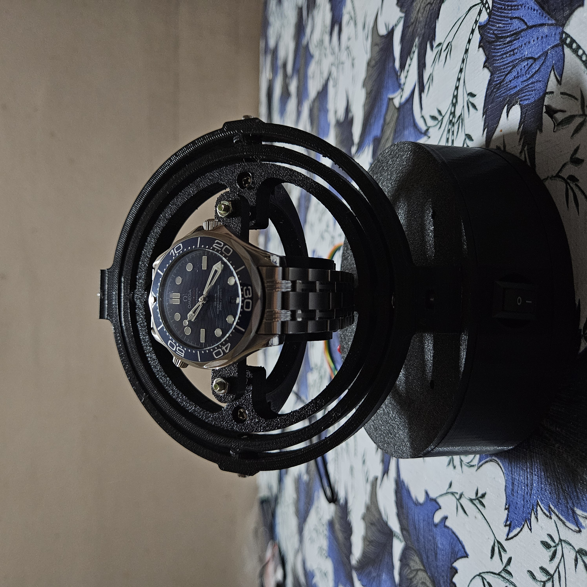

# About the Project

This project addresses the common issue faced by automatic watches: keeping them wound when not in use. The solution is a watch winder—a device designed to keep your automatic watch running smoothly even when you're not wearing it.

## The Watch

The device has been tested with the Omega Seamaster Diver 300, as shown below.

## The Winder

# Configuration

The watch winder is set to perform 1,600 turns per day (TPD) to maintain the watch's functionality. This involves alternating between clockwise and counterclockwise rotations every 15 minutes.

### Detailed Calculations

- **1 cycle** = 20 total turns (10 turns in each direction)
- **1,600 TPD** ÷ **20 turns per cycle** = **80 cycles per day**

### Time Calculation:

- **1 turn** = 4.5 seconds
- **20 turns** = 90 seconds
- **80 cycles** = 7,200 seconds (2 hours)

While it takes 2 hours of continuous rotation to achieve 1,600 TPD, such constant motion could potentially harm the watch's mechanism. To prevent this, the rotations are spread evenly throughout the day:

- **1 day** = 1,440 minutes
- **1,440 minutes** ÷ **80 cycles** = 18 minutes between cycles
- After accounting for the 90 seconds of rotation per cycle, this leaves a **15-minute pause** between each cycle.

# How It Works

## Components Used

- Arduino Nano v3.0
- 28BYJ-48 Stepper Motor + ULN2003A Driver
- A switch
- Terminal Block to DC Jack Adapter (5.5x2.5)
- 5V 1A Power Supply with 5.5x2.5 plug
- Bolts and Nuts (Socket Head Cap, unless noted otherwise):
  - 3x M3x6
  - 1x M3x8
  - 2x M3x10
  - 3x M3x12
  - 2x M3x8 (Countersunk Head)
  - 12x M3 Nuts

# The Watch Winder in Action

# Resources Utilized

- [Assembly Video](https://youtu.be/9xmiwsT9VRI?si=YJXvTsXBZpmbxH8p)
- [Code Inspiration Repository](https://github.com/fuganater/OpenWinder?tab=readme-ov-file)
- [3D Model Files](https://cults3d.com/en/3d-model/fashion/gyro-winder-watch-winder-remontoir-montre)

# Authors

- Malladi Naga Subhash (Developer) -> https://www.linkedin.com/in/malladisubhash/
- D Sai Ganesh (Visual Storyteller) -> https://www.linkedin.com/in/sai-ganesh-d-807bab185/
